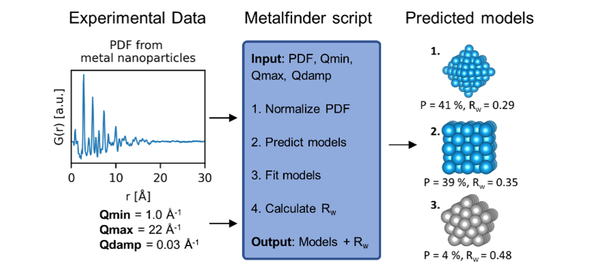

# MetalFinder (Insert rest in the same format as DeepStruc)
MetalFinder is a tree-based supervised learning algorithm which can predict the Mono-Metallic Nanoparticle (MMNP) from a Pair Distribution Function (PDF).

Currently MetalFinder is limited to MMNPs with up to 200 atoms of the 7 different structure types: 
Cubic (sc), body-centered cubic (bcc), face-centered cubic (fcc), hexagonal closed packed (hcp), decahedral, icosahedral and octahedral

